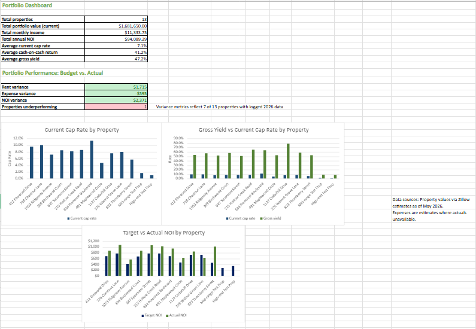

# 🏠 Rental Portfolio Financial Dashboard
 
> **Excel financial model built from real operational data** — tracking NOI, cap rate, cash-on-cash return, rent collection, and budget vs. actual variance across an 11-property residential portfolio.
 
---
 
## 📌 Project Summary
 
This model was built to solve a real problem: managing a multi-property rental portfolio with no centralized visibility into financial performance. Previously, income, expenses, and occupancy data lived in scattered records with no single source of truth.
 
This dashboard consolidates everything into one structured Excel workbook — giving a clear, real-time picture of portfolio health across 7 key metrics.
 
| Detail | Value |
|---|---|
| **Properties Tracked** | 11 residential + 2 dummy test properties |
| **Metrics Covered** | 7 (NOI, cap rate, CoC return, occupancy, variance, and more) |
| **Data Source** | Real portfolio data (addresses and tenants anonymized) |
| **Tool** | Microsoft Excel |
 
---
 
## 📊 Dashboard Preview
 

 
---
 
## 🔑 Key Features
 
### ✅ Automated Summary Dashboard
A centralized overview tab that pulls live data across all property sheets via cross-sheet formulas. No manual updating — figures refresh automatically as transactions are logged.
 
### ✅ Transaction Log
A running log of rent collections and expenses organized by property and month, structured for PivotTable analysis and dynamic filtering.
 
### ✅ Financial KPI Calculations
| Metric | What It Measures |
|---|---|
| **NOI** (Net Operating Income) | Gross rental income minus operating expenses |
| **Cap Rate** | NOI ÷ Property Value — measures return independent of financing |
| **Cash-on-Cash Return** | Annual pre-tax cash flow ÷ total cash invested |
| **Occupancy Rate** | % of units generating rent in a given period |
| **Budget vs. Actual Variance** | Planned vs. real expense/income by property and month |
 
### ✅ Cross-Sheet Architecture
Each property has its own data tab. The dashboard aggregates everything using `XLOOKUP`, `SUMIFS`, and structured cross-sheet references — keeping data clean and formulas auditable.
 
---
 
## 🛠️ Technical Details
 
**Functions & Features Used:**
- `XLOOKUP` — dynamic property lookups across tabs
- `SUMIFS` — conditional aggregation by property, month, and category
- `PivotTables` — slice and filter transaction data
- Cross-sheet cell referencing — live data flow from property tabs to dashboard
- Conditional formatting — flag variance thresholds and occupancy dips
---
 
## 💡 Why I Built This
 
I manage this portfolio directly. The model was built out of operational necessity — to track whether properties were actually performing against budget, and to identify which units were dragging overall NOI.
 
The skills applied here — financial modeling, variance analysis, data organization, and translating raw transactions into actionable KPIs — map directly to financial operations and client-facing analytical roles in the financial services industry.
 
---
 
## 📁 Files
 
| File | Description |
|---|---|
| `Real Estate Portfolio Analysis - Pham (2026).xlsx` | Full working model with all tabs, formulas, and dashboard |
| `README.md` | This documentation |
 
---
 
## 👤 About
 
**Michael Pham** — Mathematics graduate (Washington University in St. Louis) with hands-on experience in property operations, data analysis, and financial modeling.
 
Currently building a project portfolio in Excel, MySQL, and Power BI targeting roles in financial services and operations.
 
🔗 [linkedin.com/in/michaelapham99](https://www.linkedin.com/in/michaelapham99) | [GitHub Portfolio](https://github.com/michaelapham)
